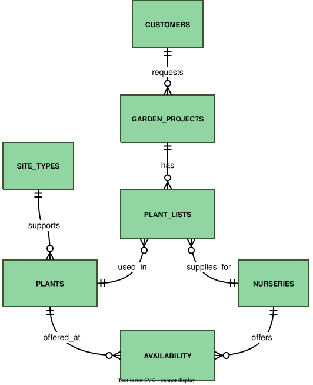

# Garden Planner Database
A relational database project for managing garden design projects, plant selection, and nursery availability.

This project was created as the final project for Harvard's CS50 course "Introduction to Databases with SQL" using SQLite. The README was originally developed as part of the course requirements and provides a detailed overview of the database design, structure, and implementation decisions.

## Overview
This database supports a gardening and landscaping company in designing and implementing garden projects for clients. It focuses on managing garden projects with an emphasis on plant selection and plant-related data, including plant attributes, availability from nurseries, and assignment to projects. Other resources, materials, and ongoing maintenance are not included.

The database includes:
* Customers: Basic identifying information for clients requesting garden projects.
* Garden Projects: Project details such as type, budget, status, and associated customer.
* Plants: Characteristics including common and botanical names, site preferences, growth requirements, and physical attributes.
* Nurseries: Plant suppliers, including contact details and location.
* Plant Availability: Stock levels and pricing for plants at each nursery.
* Plant Assignments: Which plants are used in which projects, including quantity and supplying nursery.

Out-of-scope items include:
* Employee management: Staff assignments, schedules, and labor tracking are not represented.
* Financial transactions unrelated to plant purchases: Expenses such as labor, materials, or transport are not included.
* Long-term outcomes of plantings: Survival rates, growth statistics, or ecological impact over time are not tracked, though these could support future evaluation of project success.
* Ecological information: Interactions with insects or wildlife are not tracked, limiting support for specialized requests like “butterfly-friendly” or conservation-focused gardens.
* Image support: The database does not store images of plants or garden designs, including spatial layouts.

## Functional Requirements
This database is designed to facilitate:
* Finding suitable plants for certain garden conditions and customer preferences
* View which nurseries supply specific plants and their stock levels
* Evaluate plant prices across different nurseries
* Add, update, and track client and project information
* Assigning plants to projects and tracking their quantities
* Auto-calculate costs
* Monitor total project cost against the defined budget

Users cannot:
* Modify or delete completed projects, as these are locked by triggers.
* Add, update, or remove plants from projects that are completed or cancelled.
* Manually edit calculated fields such as costs, since these are automatically maintained by triggers.
* Change the project assignment (project_id) of existing plant list entries, ensuring cost consistency.

## Representation
All entities are stored in SQLite tables. Unless noted otherwise, numeric fields, such as IDs, use type `INTEGER`, while textual fields, such as names or descriptions, use type `TEXT`.

### Entities
The database includes the following entities:

#### Site Types
The `site_types` table defines common planting environments and their growing conditions. It serves as a reference for matching plants to suitable sites during project planning.

This table includes:
* `id` (`INTEGER`): uniquely identifies each site type. It has a `PRIMARY KEY` constraint to ensure uniqueness.
* `name` (`TEXT`): the name of the site type. It is `NOT NULL` and `UNIQUE` to guarantee every site type has a distinct name.
* `soil_type` (`TEXT`): describes the soil conditions of the site. This is `NOT NULL` because soil type is a core characteristic of a site.
* `nutrient_level` (`TEXT`): indicates the nutrient availability at the site. It is `NOT NULL` as it is essential for defining site suitability.
* `sunlight_requirement` (`TEXT`): specifies the sunlight exposure required. This field is `NOT NULL` since it is a primary factor in site classification.
* `water_requirement` (`TEXT`): indicates typical water needs. This field is optional (`NULL`) because it provides extra detail but is not essential for defining the site type.
* `is_deleted` (`INTEGER`): marks whether the site type has been soft-deleted. It is `NOT NULL` with a default value of `0`, i.e., entries are not deleted unless explicitly marked.

**Implementation Choices**:
* The `name` column is `UNIQUE` to prevent duplicate site types.
* All descriptive attributes are defined as `NOT NULL` to ensure each site type provides a complete specification for plant classification.
* Soft deletion: This allows the system to stop using a nursery in future projects while preserving historical data for past projects, which may be needed for audits, accounting, or tracking suppliers that have gone out of business.

#### Plants
The `plants` table stores plant species used in garden projects, including names and horticultural characteristics. It helps planners select suitable plants for projects.

This table includes:
* `id` (`INTEGER`): uniquely identifies each plant. `PRIMARY KEY` ensures uniqueness.
* `common_name` (`TEXT`): the plant’s common name. `NOT NULL` ensures every plant has a recognizable name.
* `botanical_name` (`TEXT`): the plant’s scientific name. `NOT NULL` and `UNIQUE` prevent duplicates and ensure accurate identification.
* `primary_site_type_id` (`INTEGER`): links the plant to its preferred site type. `FOREIGN KEY` references `site_types(id)` for data integrity.
* `plant_type` (`TEXT`): plant category (e.g., perennial, annual). Optional (`NULL`) if unknown.
* `soil_type` (`TEXT`): preferred soil (e.g. loamy, sandy). Optional.
* `nutrient_level` (`TEXT`): nutrient requirements (e.g. low, medium, high). Optional.
* `sunlight_requirement` (`TEXT`): sunlight needs (e.g. full sun, shade). Optional.
* `water_requirement` (`TEXT`): water needs (e.g. low, medium, high). Optional.
* `height_cm` (`INTEGER`): typical height in centimeters. Optional.
* `flower_color` (`TEXT`): flower color. Optional.
* `flowering_season` (`TEXT`): the plant’s blooming season. Optional.
* `is_deleted` (`INTEGER`): marks soft deletion. `NOT NULL` with default `0`; entries are active unless explicitly marked deleted.

**Implementation Choices**:
* A plant's botanical name must be unique because no two plant species share the exact same scientific name. In contrast, the common name can be duplicated, since common names vary by region and dialect and are not standardized (for example, “bluebell” can refer to both Hyacinthoides non-scripta and Mertensia virginica, and “buttercup” may refer to multiple species in the genus Ranunculus). Not enforcing uniqueness on the common name avoids false duplicates.
* Other attributes (soil type, sunlight requirement, water requirement, height, flower color, flowering season) are optional, allowing incomplete plant data to be stored and updated later.
* Soft deletion: This allows stopping the use of a plant in future projects while preserving historical data about past projects where the plant was used.

#### Nurseries
The `nurseries` table stores information about plant suppliers, allowing the system to track which plants are available from which sources.

This table includes:
* `id` (`INTEGER`): unique ID for each nursery. `PRIMARY KEY` ensures each nursery is uniquely identified.
* `name` (`TEXT`): nursery name. `NOT NULL` and `UNIQUE` ensure every nursery has a distinct name.
* `phone` (`TEXT`): contact phone number. `NOT NULL` ensures a number is provided.
* `email` (`TEXT`): contact email. `NOT NULL` ensures an email is provided.
* `address` (`TEXT`): street address. `NOT NULL` ensures the address is recorded.
* `url` (`TEXT`): website. Optional; can be `NULL`.
* `city` and `state` (`TEXT`): location of the nursery. Both `NOT NULL`.
* `is_deleted` (`INTEGER`): marks soft deletion. `NOT NULL` with default `0` ensures active entries unless explicitly deleted.

**Implementation Choices**:
* Phone numbers, emails, and addresses are not required to be unique, because multiple nurseries may share contact points or locations (for example, in a greenhouse complex).
* The url field is optional because some nurseries may not have a website.
* Soft deletion is used instead of hard deletion. This allows the system to stop using a nursery in future projects while preserving historical data for past projects, which may be needed for audits, accounting, or tracking suppliers that have gone out of business.

#### Customers
The `customers` table stores information about clients requesting garden projects, allowing the system to track which projects belong to which clients.

This table includes:
* `id` (`INTEGER`): unique ID for each customer. `PRIMARY KEY` ensures each customer is uniquely identified.
* `first_name` (`TEXT`): customer’s first name. `NOT NULL` ensures it is always recorded.
* `last_name` (`TEXT`): customer’s last name. `NOT NULL` ensures it is always recorded.
* `phone` (`TEXT`): contact phone number. `NOT NULL` ensures contact information is available.
* `email` (`TEXT`): contact email. `NOT NULL` ensures an email is provided.
* `address` (`TEXT`): street address. `NOT NULL` ensures the location is recorded.
* `is_deleted` (`INTEGER`): marks soft deletion. `NOT NULL` with default `0` ensures active entries unless explicitly deleted.
* Unique constraint on (`first_name`, `last_name`, `phone`): prevents duplicate entries for the same customer.

**Implementation Choices**:
* Contact fields such as `phone` and `email` are not required to be unique. While many customers have unique contact details, it is possible for multiple people to share a phone number or email address (for example, members of the same household). Enforcing uniqueness on these fields could therefore prevent legitimate entries.
* The `address` field is also not unique, since multiple customers may live at the same address and request separate garden projects.
* To reduce accidental duplicate entries, the schema uses a composite unique constraint on `first_name`, `last_name`, and `phone`. This combination provides a reasonable balance between preventing duplicate records and allowing legitimate cases where individuals share names or contact details. While not completely foolproof, it reduces the likelihood of entering the same customer multiple times without introducing excessive complexity.
* Soft deletion: In practice, customer records often need to be retained for legal, accounting, and historical reasons, such as invoices, past projects, or communication records. Soft deletion allows customers to be excluded from active use while preserving historical data.

#### Garden Projects
The `garden_projects` table stores information about garden design projects requested by customers. It tracks project timelines, budgets, costs, and status.

This table includes:
* `id` (`INTEGER`): unique ID for each project. `PRIMARY KEY` ensures uniqueness.
* `customer_id` (`INTEGER`): references the customer who requested the project. `FOREIGN KEY` referencing `customers(id)` ensures each project belongs to a valid customer.
* `project_type` (`TEXT`): type or description of the garden project. `NOT NULL` ensures every project has a defined type.
* `start_date` (`NUMERIC): planned or actual start date. Can be `NULL` if not started yet.
* `end_date` (`NUMERIC`): completion date. Can be `NULL` if not yet completed.
* `budget` (`NUMERIC`): total planned budget. `NOT NULL` and `CHECK (budget >= 0)` ensure a valid, non-negative budget.
* `costs` (`NUMERIC`): total cost of plants assigned to the project. Can be `NULL` initially. `CHECK (costs >= 0)` ensures no negative values.
* `status` (`TEXT`): current project status. `NOT NULL` with default `'in_planning'`.

**Implementation Choices**:
* Most columns are defined with the `NOT NULL` constraint to ensure that essential project information is always recorded. The only exceptions are `start_date`, `end_date`, and `costs`, which can be `NULL`. This allows projects to be entered early in the planning process. Typically, a project is created after an initial discussion with the customer, when the project type and budget are already known. Additional information such as the plant list, calculated costs, and scheduled start date can be added later as planning progresses.
* The `start_date` and `end_date` columns use the `NUMERIC` type instead of `TEXT`. SQLite commonly stores timestamps and dates as numeric values, which allows easier comparison and validation (for example ensuring that the start date occurs before the end date).
* The `budget` and `costs` columns use the `NUMERIC` type. Using floating point values (`REAL`) for monetary amounts can lead to rounding errors (for example storing `19.999999` instead of `20.00`). `NUMERIC` is therefore more appropriate for representing financial values.
* The table does not include a soft deletion column. Instead, the `status` column represents the lifecycle of a project. Possible states include `in_planning`, `in_progress`, `completed`, and `cancelled`. Completed or cancelled projects remain in the database for historical reference, while queries can easily filter for active projects.
* **Cost Calculation for Garden Projects**:
    * Automatic calculation via triggers: The `costs` field in `garden_projects` is updated automatically using triggers that sum `quantity × purchase_price_per_pot` from `plant_lists`.
    * Full recalculation vs incremental addition: A full recalculation approach was chosen rather than incremental updates. Incremental updates are slightly more efficient but can drift out of sync if multiple changes happen at once or if there are manual edits outside the trigger logic. Over time, this can lead to stored totals diverging from the true sum. Full recalculation always computes the total from the current state after inserts, updates, or deletions, guaranteeing that `costs` reflects the true sum of all plant batches. The computational difference is meaningless. The correctness difference is significant.
    * Handling NULL values: The `SUM()` function may return `NULL` when no plants are assigned. This is intentional, as it distinguishes between a project that exists but has no planned plants (`NULL`) and a project with plants totaling zero cost (`0`).

**Triggers**:

**Closed Project Protection Triggers**:
* `prevent_update_of_closed_projects`: Prevents updates to projects that are marked as `completed` or `cancelled`.
* `prevent_delete_of_closed_projects`: Prevents deleting projects that are marked as `completed`.
Once a garden project is marked as `completed` or `cancelled`, it represents a finalized historical record. At this stage, the project’s information (including its plant list, budget, and final costs) should remain unchanged to preserve accurate documentation of the project.
These triggers enforce this rule by blocking any attempt to update or delete such projects. This prevents accidental modification or removal of historical project data and ensures that completed or cancelled projects remain permanently stored for reference, reporting, and auditing purposes.

#### Plant Lists
The `plant_lists` table stores the plants assigned to garden projects, including quantity and sourcing nursery. It allows the system to track which and how many plants are used in each project.

This table includes:
* `id` (`INTEGER`): unique ID for each plant assignment. `PRIMARY KEY` ensures uniqueness.
* `project_id` (`INTEGER`): references the garden project. `FOREIGN KEY` referencing `garden_projects(id)` ensures each assignment belongs to a valid project.
* `plant_id` (`INTEGER`): references the plant used. `FOREIGN KEY` referencing `plants(id)` ensures only existing plants can be assigned.
* `nursery_id` (`INTEGER`): references the supplying nursery. `FOREIGN KEY` referencing `nurseries(id)` ensures the supplier exists.
* `quantity` (`INTEGER`): number of plants acquired for the project. `NOT NULL` and `CHECK (quantity > 0)` ensure valid quantities.
* `purchase_price_per_pot` (`NUMERIC`): cost per plant. `NOT NULL` and `CHECK (purchase_price_per_pot >= 0)` ensure non-negative pricing.

**Implementation Choices**:
* All columns are defined as `NOT NULL` because each entry represents a concrete purchasing or planning decision. When a plant is added to a project, its plant, supplier, quantity, and price must already be known. Allowing `NULL` values would compromise data reliability.
* The table uses its own `id` as the `PRIMARY KEY`, enabling the same plant to appear multiple times in the same project, even from the same nursery. Each row represents a distinct purchase event or batch, accommodating scenarios like different delivery dates, separate orders, or variable pricing due to special offers. Two rows may therefore contain identical plant, nursery, and quantity values but still represent different purchase events.
* The `project_id` foreign key uses `ON DELETE CASCADE`. Since plant list entries exist only within the context of a project, deleting a project automatically removes its associated plant entries, maintaining data integrity.
* Cascading deletes are not used for `plant_id` or `nursery_id`. Deleting a plant or nursery should not remove historical purchase records from past projects. If cascading deletes were enabled, removing a plant or nursery could erase plant list entries and alter historical cost calculations, which would corrupt project history and financial records. Instead, these foreign keys use `ON DELETE RESTRICT`, which prevents a plant or nursery from being deleted while it is still referenced in the `plant_lists` table. While SQLite’s default NO ACTION would behave similarly, RESTRICT is explicitly chosen to clarify the intended data protection.

**Triggers**:

**Cost Calculation Triggers**:
These triggers automatically update a project’s total costs whenever plant batches are added, modified, or removed, ensuring financial accuracy.
The total cost of a project is calculated as the sum of all plant batch costs, where each batch’s cost is quantity * purchase_price_per_pot. This calculation depends directly on the quantity, purchase price, plant, and nursery recorded in the plant_lists table for that project.

The following triggers implement this automation:
* `update_project_costs_after_insert`: Recalculates the project’s total costs after a new plant batch is added.
* `update_project_costs_after_update`: Recalculates the project’s total costs when a plant batch is modified (quantity, price, plant, or nursery).
* `update_project_costs_after_delete`: Recalculates the project’s total costs when a plant batch is removed.
Without these triggers, users would need to update project costs manually after each change, increasing the risk of errors and inconsistent financial data. By automating this process, the database maintains accurate, real-time project budgets.

**Plant Lists Freezing Triggers**:
Once a garden project is marked as `completed` or `cancelled`, it becomes a finalized historical record. At this point, the associated plant list must remain unchanged to preserve project documentation and cost accuracy.
The following triggers enforce this:
* `prevent_plant_insert_on_closed_projects`: Blocks adding new plant batches into completed or cancelled projects.
* `prevent_plant_update_on_closed_projects`: Blocks updating plant batches of completed or cancelled projects.
* `prevent_plant_delete_on_closed_projects`: Blocks deleting plant batches from completed or cancelled projects.
These triggers ensure that plant lists for closed projects remain consistent with the project’s status.

**Project Consistency Trigger**:
* `prevent_project_id_change`: Prevents changing the `project_id` of an existing plant batch.
Each plant batch belongs to a specific project. Allowing project_id updates would move purchases between projects, corrupting historical records and cost calculations. Instead, if a batch is assigned incorrectly, it must be deleted and reinserted with the correct `project_id`. This guarantees that project costs and historical data remain accurate and consistent.

#### Availability
The `availability` table stores which plants are supplied by which nurseries, including stock levels, pot sizes, pricing, and lead times. It allows the system to determine which plants can be purchased for a project and from which supplier.

This table includes:
* `plant_id` (`INTEGER`): specifies the plant being supplied. `FOREIGN KEY` referencing `plants(id)` ensures the plant exists in the database.
* `nursery_id` (`INTEGER`): specifies the nursery supplying the plant. `FOREIGN KEY` referencing `nurseries(id)` ensures the supplier exists.
* `stock_quantity` (`INTEGER`): number of plants currently in stock at the nursery. `NOT NULL` with `CHECK (stock_quantity >= 0)` ensures valid values.
* `pot_size` (`TEXT`): size of the pot for the plant (e.g. small, medium, large). `NOT NULL` because pot size is important for project planning.
* `price_per_pot` (`NUMERIC`): purchase price per plant. `NOT NULL` with `CHECK (price_per_pot >= 0)` ensures valid values.
* `lead_time_days` (`INTEGER`): days until the plant can be delivered. Optional (`NULL` allowed) with `CHECK (lead_time_days >= 0)` if provided.
* Composite `PRIMARY KEY (plant_id, nursery_id)`: ensures each nursery has at most one record per plant, avoiding duplicates.

**Implementation Choices**:
* The table uses a composite primary key `(plant_id, nursery_id)` to model the many-to-many relationship: a plant can be supplied by multiple nurseries, and a nursery can supply multiple plants. The composite key ensures that a nursery can only have one availability record per plant, preventing duplicate entries. This also implies a limitation: each plant–nursery combination can have only one standard pot size and price at a time.
* The `stock_quantity` column includes a `CHECK` constraint to prevent negative values. A quantity of zero is allowed because a plant may still be orderable if there is a lead time. Thus, the system can plan for future deliveries even when current stock is depleted.
* The `price_per_pot` column uses the `NUMERIC` type instead of `REAL` to avoid rounding errors when calculating costs and to ensure accurate budgeting.
* The `lead_time_days` column is optional and can be `NULL` if unknown or not available. When present, it has a `CHECK` constraint to ensure non-negative values.
* No soft deletion is implemented for this table. Availability represents operational data that can change over time and does not need to be preserved. Unlike `plant_lists`, this table is used for planning and ordering, not project history.
* Although nurseries and plants are normally soft-deleted, defining `ON DELETE CASCADE` on foreign keys safeguards against orphaned rows if hard deletions occur, maintaining table consistency during exceptional maintenance or future schema changes.

**Triggers**:

**Availability Maintenance Trigger**:
* `remove_availability_when_nursery_soft_deleted`: Removes all availability entries when a nursery is soft-deleted.
Since `availability` represents operational data, plants from a soft-deleted nursery should no longer appear as available. This trigger ensures planning queries only return active suppliers and prevents outdated or orphaned availability records, while still keeping the nursery record for historical reference.

### Relationships
The database entities are connected as follows:

* Each customer may request multiple garden projects, while each project is linked to a single customer.
* A garden project can include multiple plant list entries, with each entry belonging to one project.
* Each plant may appear in multiple plant list entries, but each entry references only one plant.
* A nursery can supply multiple plant list entries, while each entry comes from a single nursery.
* Each plant can have multiple availability records, with each record tied to one plant.
* A nursery can maintain multiple availability records, each associated with that nursery.
* A site type can be the primary site for many plants, and each plant is assigned to one primary site type.

## Optimizations

### Views

**`plant_catalog` View**:
* This view provides a ready-to-use catalog of plants for garden planning, combining plant details with their primary site type and availability at nurseries. Each row shows the common and botanical names, site type, plant type, dimensions, flowering characteristics, and environmental requirements (soil, sunlight, water). The view includes only non-deleted plants that are currently available (in stock or with a lead time), streamlining design decisions while keeping sourcing separate.
* The main purpose of this view is to filter plants by site type, which is the planner’s first and most important selection criterion. Planners identify the site types in the customer’s garden and use this view to find plants that match those conditions. By presenting all relevant attributes in one place, the view allows quick, accurate selection of suitable plants while avoiding data not needed for this planning phase.
* An `EXISTS` clause ensures each plant appears only once in the view, even if multiple nurseries supply it. This avoids duplicate rows per nursery while still filtering out unavailable or deleted plants, keeping the catalog clean and easy to use.

**`active_projects` View**:
* This view provides a clear overview of all ongoing garden projects, combining project details, customer information, and aggregated plant data. Each row represents one active project, showing who the customer is, how much budget remains, and how many plants are involved.
* A `LEFT JOIN` between `garden_projects` and `plant_lists` ensures that projects with no assigned plants still appear in the view, with 0 quantities, instead of being excluded as they would be with an `INNER JOIN`.
* The calculation `(gp.budget - COALESCE(gp.costs, 0)) AS remaining_budget` ensures that if `budget` is `NULL`, the remaining budget is `NULL`, and if `costs` is `NULL`, the remaining budget equals the budget.
* For `SUM(pl.quantity) AS total_quantity`, the `LEFT JOIN` combined with `GROUP BY` behaves as follows: if there are no matching plant rows, `SUM` returns `NULL`; otherwise, it returns the total quantity. No `COALESCE` is needed in this case.

### Indexes

**Index on plants.primary_site_type_id**:
* This index optimizes filtering plants by site type, which is a core operation during planning and heavily used in the `plant_catalog` view.
* Although the `plants` table already has a primary key index on `id`, this does not help with filtering by site type. Indexing the foreign key `primary_site_type_id` allows the database to quickly locate all plants belonging to a given site type and significantly speeds up joins with the `site_types` table by avoiding a full table scan and significantly improving query performance.

**Index on availability.plant_id**:
* This index improves queries that check availability for a specific plant. This is a common operation during planning, where users need to quickly retrieve nurseries, stock quantities, prices, and lead times for a selected plant. The index allows the database to locate all relevant rows without scanning the entire table, which becomes increasingly important as the availability data grows.
* It also speeds up the EXISTS check in the plant_catalog view.
Since the table already has a composite primary key on `(plant_id, nursery_id)`, which also providess an index starting with `plant_id`, this additional index may be partially redundant. However, it can still be justified to explicitly optimize and clarify queries that primarily filter by `plant_id`.

**Index on plant_lists.project_id, plant_id**:
* The composite index on `plant_lists(project_id, plant_id)` was created to optimize queries that retrieve and aggregate plants for a specific garden project. This is a frequent operation, as plant lists are accessed when reviewing projects and when recalculating costs. The index allows the database to quickly locate all rows belonging to a given project and efficiently group or aggregate them by plant.
* Compared to a single-column index on project_id, the composite index also orders rows by plant_id, which improves performance for queries that summarize plant lists within a project. In these queries, individual purchase batches are not relevant; instead, plants are aggregated by type to determine total quantities per plant. Since this is a common operation when reviewing project plant lists, the composite index supports efficient grouping and retrieval of this data.

**Indexes Not Implemented**:
* Additional indexes were considered but not implemented. For example, an index on `plants(flower_color, height_cm)` could improve performance for filtering by visual characteristics, but such queries are not expected to be common in typical usage.
* Similarly, an index on `garden_projects(status)` could optimize queries on active projects, but this is only beneficial for a large number of projects. Given the expected data size, these indexes were deemed unnecessary.
* An index on `site_types(name)` was not added because the table is small, making scans inexpensive.

## Limitations
The following limitations reflect simplifications made for this project and areas where the database cannot fully represent real-world complexity:
* No column for notes: Tables do not support free-text remarks for plants, projects, or nurseries.
* Simplified plant availability: Each plant at a nursery has only one standard pot size and price, even though multiple sizes with different prices are common in reality.
* Single site type per plant: Plants are assigned to only one site type, even though many species tolerate multiple conditions.
* No logging of database actions: There is no table for log files or timestamps of actions, such as when a project is created or when plants are added to a plant list. This limits auditability and tracking of changes over time.
* Limited enforcement of project status rules: Although triggers prevent modifying or deleting completed projects and their plant lists, the database does not fully prevent changes to the `status` column itself. Without additional triggers, a user could technically revert a completed project to an earlier status. Fully enforcing project lifecycles would require additional triggers to block any illegal status transitions and ensure completed projects are truly immutable.
* Single-value attributes: Fields such as common_name allow only one value, although multiple names may exist (e.g., regional variations).
